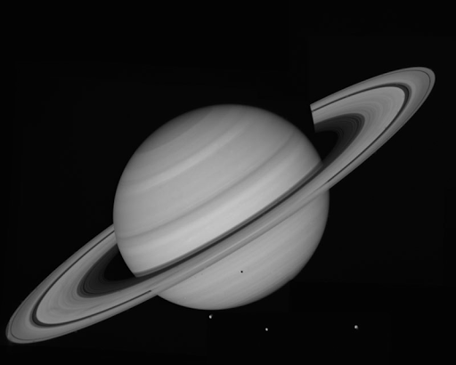
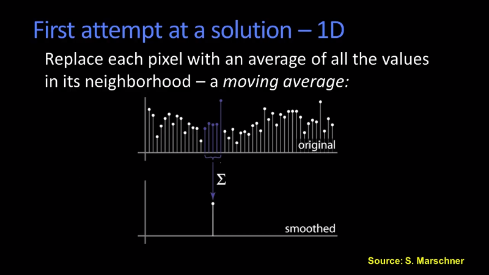
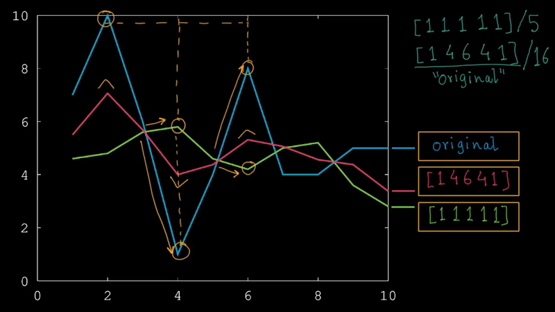
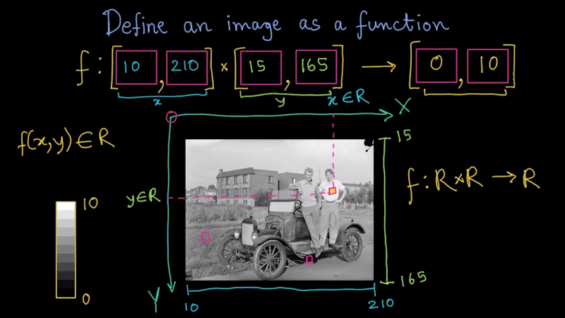
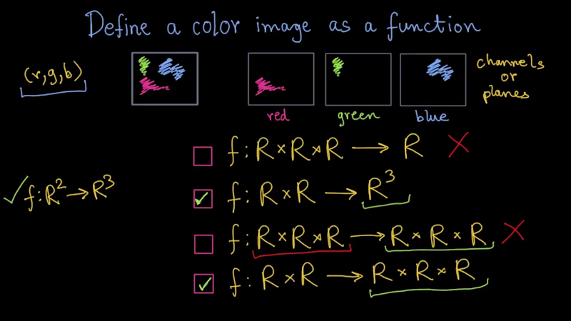
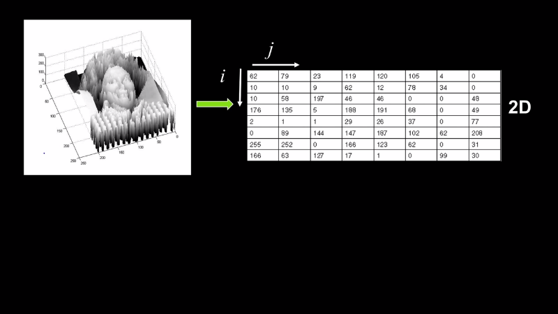
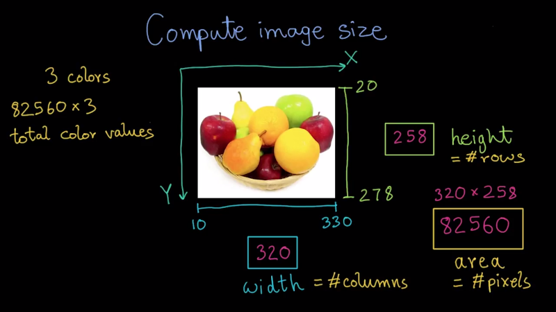
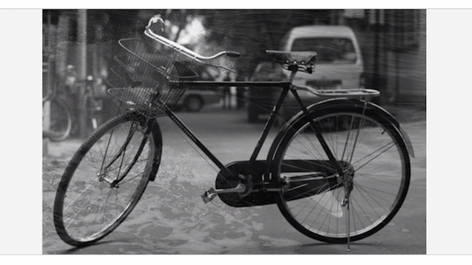

ⓒ JMC 2017

**SOURCE**  
\- [Udacity, Introduction to Computer Vision](https://classroom.udacity.com/courses/ud810 )  
\- [Udacity, Introduction to Computer Vision (YouTube) ](https://www.youtube.com/playlist?list=PLAwxTw4SYaPnbDacyrK_kB_RUkuxQBlCm )  

**RESUME**  
\- `https://classroom.udacity.com/courses/ud810/lessons/3452628581/concepts/34027789540923`

**RULE**  
\- [YouTube 동영상 스크린샷 사이트](http://www.youtubescreenshot.com/ )  
\- 첨부 이미지 width는 800으로 고정

---

## One-Sentence Summary

### 01 Introduction

+ Computer Vision의 목표는 이미지를 해석(interpret)하는 것이다.

### 02 Image as Functions

+ 이미지는 2차원 좌표값 (x, y)에 픽셀 값을 가지는 함수( 또는 )로 볼 수 있다.

### 03 Filtering

+ 기존 이미지 함수에 새로운 함수를 더하면 기존 이미지가 필터링된다.

### 04 Linearity and convolution

+ 우리가 이미지 연산에 사용할 필터링 연산은 linear하기 때문에 각 이미지 픽셀에 필터링을 적용한 것이나 전체에 필터링을 적용한 것이나 마찬가지다.
+ linear의 조건:
  + 덧셈의 분배법칙 성립: 
  + 곱셈 스케일링 : 


---
---
---
---

## 03 Filtering (2)

### 가우시안 시그마의 의미 (sigma over a intensity)

+ 가우시안 분포의 넓이(width of a Gaussian)를 결정한다.
+ 블러링(blurring) 또는 스무딩(smoothing)의 변화(variance)의 정도를 결정한다.

### Octave 실습

```
% Apply a Gaussian filter to remove noise
img = imread('saturn.png');
imshow(img);

% TODO: Add noise to the image
noise_sigma = 25;
noise = randn(size(img)) .* noise_sigma;
noisy_img = img + noise;
imshow(noisy_img);

% TODO: Now apply a Gaussian filter to smooth out the noise
% Note: You may need to pkg load image;
filter_size = 31;
filter_sigma = 5;

pkg load image;

filter = fspecial('gaussian', filter_size, filter_sigma);

% Apply it to remove noise

smoothed = imfilter(noisy_img, filter);

surf(filter);
imagesc(filter);

imshow(smoothed);
```




---

## 03 Filtering (1)

### 노이즈 제거에 대한 아이디어

+ 원래 픽셀 값을 구하기 위해 주변 픽셀 값을 평균을 내서 각 픽셀의 값으로 대체한다.



### 노이즈 제거에 대한 아이디어 원리

+ 평균으로 노이즈 제거를 할 수 있는 이유는 다음과 같은 가정 때문이다.
  1. 원래 픽셀 값은 주변 픽셀 값과 유사했을 것이다.
  2. 각 픽셀에 더해진 노이즈는 주변 픽셀 값과 상관없었을 것(independent)이다.


### 노이즈 제거의 실현 가능성

+ 노이즈 함수를 알면 그대로 subtraction하면 되지만 노이즈 함수를 모르므로 실제로 노이즈를 제거할 수는 없다.
+ 또한 노이즈가 더해지면서 정보의 손실이 발생하므로 완벽한 노이즈 제거는 불가능하다.
  + ex) true pixel value + noise value = 230 + 80 = 255 (in case maximum is 255)
  + ex) convoluted value - noise value = 255 - 80 = 175
  + ex) therefore, 230 != 175

### 노이즈 제거 방법 :: Averaging vs. (Center) Weighted Averaging

+ Averaging : 주변 값에 가중치를 동등하게 두는 unifrom filter
+ Weighted Averaging : 중앙에 가까운 값에 더 큰 가중치를 두는 non-uniform filter (odd symmetric mask)

> **Note:** odd symmetric mask : 홀수 개를 가진 대칭 필터



+ `blue line` : original
+ `green line` : uniform filter를 적용한 결과
+ `red line` : non-uniform filter를 적용한 결과
+ 필터를 적용할 때는 필터의 합이 1이 되도록 맞춰준다.
  + [11111]/5
  + [14641]/16

+ 해석
  1. uniform filter는 중앙으로부터 먼 값이 가까운 값과 같은 영향력을 가지므로 그 영향력이 상대적으로 지나치다. 따라서 그림의 동그라미에서 볼 수 있듯이 peak와 trough를 왜곡하는 경우가 발생했다.
  2. non-uniform filter는 중앙에 가까울수록 영향력이 커지므로 순리에 잘 맞다. 따라서 peak와 trough가 잘 보존되었다.

> **Note:** Averaging은 기본적으로 이동하면서 적용하므로 Moving Averaging을 뜻한다.

@@@re-resume : 9. Correlation Filtering `https://classroom.udacity.com/courses/ud810/lessons/3417359075/concepts/34235689540923`

**끝.**

---

## 02 Images as Functions (2)

### 노이즈를 함수로 보기

<p align="center"></p>

+ 노이즈(noise)란 하나의 함수()로써 기존 이미지()에 더해져서 새로운 이미지()를 만들어 낸다.

### 노이즈 사례

+ (Salt and pepper noise) 점잡음 : 흰색과 검은색 픽셀(=점)들이 랜덤하게 분포
+ (Impulse noise) 임펄스 잡음 : 흰색 픽셀들이 랜덤하게 분포
+ (Gaussian noise) 가우시안 노이즈 : 가우시안 분포로부터 얻은 픽셀값의 변화

### 노이즈 만들기

```
noise = randn(size(im)) .* sigma;
output = im + noise;
```

+ `randn` : 가우시안 노이즈를 만들어낸다. (평균 0, 표준편차 1)
+ `.* sigma` : 노이즈 신호에 `sigma`를 곱해서 scale 조정을 해준다.
+ `output` : 오리지널 이미지의 함수에 노이즈 함수를 더한다.

### 시그마의 의미와 크기에 따른 변화 (sigma over a space)

+ 가우시안 노이즈에 `sigma` 2를 곱하면 분포의 형태가 어떻게 될까?
  + 값의 개수는 변하지 않는다 : 꼭대기가 올라가지 않는다.
  + 값의 차이가 커진다 : 분포가 넓어진다 (**widen**).
+ 오리지널 이미지에 가우시안 노이즈를 합성할 때 가우시안의 시그마를 증가시키면 오리지널 이미지의 변화량이 커진다.
+ **시그마의 의미** : 가우시안 분포의 넓이(width of Gaussian)를 결정한다.
+ **노이즈 합성에서 시그마의 크기에 따른 효과** : 합성할 오리지널 이미지의 픽셀 값의 변화량을 좌우한다. 시그마가 커질수록 값의 분포가 넓어지며 white 픽셀과 black 픽셀이 많아진다.


### 시그마의 크기와 픽셀 값의 범위

+ 시그마의 크기는 아무렇게나 정할 수는 없고 적용하려는 픽셀 값(intensity or value)의 범위를 고려해야 한다.
+ 가령, 흑백 이미지에서 minmum value는 black, maximum value는 white가 될 텐데
  + 픽셀 값의 범위가 0~255인 경우 : sigma 2를 적용하면 큰 변화가 없다.
  + 픽셀 값의 범위가 0~1인 경우 : sigma 25를 적용하면 black과 white 픽셀이 난무하게 된다. sigma 0.1을 적용하면 적당할 것이다.
+ **노이즈 합성에서 시그마 크기의 의미** : black에서 white로 변화하는 양에 대한 비율을 뜻한다.
  + 픽셀 값의 범위가 0~1인 경우 sigma를 0.1로 잡는다면 black에서 white로 변화하는 비율을 0.1로 잡은 것이다.

**끝.**

---

## 02 Images as Functions (1)

### 이미지를 다른 관점으로 보기

1. 특정 범위의 숫자로 이루어진 2차원 배열
2. x값과 y값으로 구성되는 `함수`  (또는 )
3. 카메라로 만들어지는 어떤 것

> **Note:** `함수` : 이미지를 함수로 보면, 이미지 내 모든 픽셀 값이 output이 되고 input은 좌표 (x, y)값이 된다. 즉, 이미지는 서로 다른 위치의 펙셀 값을 하나로 모은 것이라고 할 수 있다.

### Math :: 흑백 이미지를 함수로 보기



+ 는 `좌표 (x, y)`에 해당하는 `픽셀`의 강도(intensity) 또는 값(value)을 의미한다.

> **Note:** `픽셀` : 컴퓨터에서 이미지를 구성하는 기본 단위 (pixel stands for picture elemetns)

<p align="center"></p>

+ 그런데 함수 는 minimum value와 maximum value라는 range를 가진다.
+ 흑백이므로 컬러 없이 밝기(lightness)로만 픽셀 값을 정할 수 있다.
+ min : black
+ max : white
+ 핑크색 동그라미를 x, y 좌표의 origin(원점)이라고 할 때 x좌표와 y좌표의 값도 특정 범주에 속하게 된다.

> **Note:** `좌표 (x, y)` : 일반적으로 x축은 가로, y축은 세로를 의미한다.

### Math :: 컬러 이미지를 함수로 보기



<p align="center"></p>

+ 흑백 이미지와 다르게 3가지 컬러 값으로 표현하므로 함수의 값이 vector로 표현된다.
+ 모든 이미지는 x좌표와 y좌표로 구성된 2차원이므로 로 표현한다.
+ 그런데 함수의 값은 3가지 값으로 구성되므로 이 된다.

### Computer (digital) :: 이미지를 디지타이즈하여 행렬로 보기



1. (`Sample`) 격자 무늬의 2차원 공간에 표현
2. (`Quantize`) 모든 샘플을 정수에 가깝도록 불연속적인 값으로 변환
    + 컬러 값을 0부터 255까지의 정수로 나타내기
3. (matrix) 모든 이미지가 정수 값으로 구성된 행렬로 표현됨

> **Note:**   
> `Sample` : 현실의 이미지는 연속적인 값을 가진다. 하지만 디지털로 나타내려면 불연속적인 값으로 나타내야 한다. 연속적인 값에서 불연속적인 값으로 특정 값을 추출하므로 샘플링한다고 표현한다.  
> `Quantize` : '양자화'란 연속적인 값을 불연속적인 값으로 변환하는 것을 뜻한다.

### Computer :: 이미지의 크기



+ 이미지의 크기를 알려면 먼저 픽셀의 수를 알아야 한다.
+ 픽셀의 수 (82560) = x축 크기 (258) * y축 크기 (320)
+ 한 픽셀 당 3가지 색을 표현한다.
+ 그런데 보통 1가지 색을 0~255의 값으로 표현할 때 이므로 8bit, 즉 1byte의 메모리를 사용한다.
+ 따라서 한 픽셀을 표현하는데 3byte가 사용된다.
+ 그러므로 전체 이미지의 크기 (247,680byte = 약 241kb) = 픽셀의 수 (82560) * 픽셀 당 메모리 (3byte)

### Octave 실습

```
% Load and display an image
img = imread('dolphin.png');
imshow(img);

% size and class
disp(size(img));       # 320 500
disp(class(img));      # uint8
```

+ `uint8` :
    + u : unsigned (음수를 표현하지 않는 데이터 타입)
    + int : integers
    + 8 : bit depth (값을 저장할 수 있는 비트 크기)

### Octave 실습 :: 이미지 블렌딩

```
% Blend two images
function output = blend(a, b, alpha)
    % TODO: Your code here; finally assign: output = <something>;
    output = alpha .* a + (1-alpha) .* b;
endfunction

% function 리턴할-변수명 = 함수명(parameters);

% Test code:
dolphin = imread('dolphin.png');
bicycle = imread('bicycle.png');

result = blend(dolphin, bicycle, 0.25);
imshow(result); % note: will result in an error if blend() returns empty or incorrect value
```



+ `dolphin.jpg`를 0.25만큼, `bicycle.jpg`를 0.75만큼 섞었더니 물가에 있는 자전거 사진처럼 블렌딩 되었다.

**끝.**

---

## 01 Introduction

### Computer Vision의 목표

+ 컴퓨터 비전의 목표는 "**이미지를 해석하는 컴퓨터 프로그램을 만드는 것**"이다.
+ 왜냐하면 모든 이미지는 `스토리`를 담고 있기 때문이다.

> **Note:** `스토리` : 묘사 가능한 성질(able to make a description)

### Computer Vision의 원리

+ 이미지를 입력한 후 이미지가 갖고 있는 의미를 끌어낸다.
+ Image-in, Meaning-out

### Computer Vision을 알면 좋은 이유

+ `이미지`가 쓰이지 않는 곳은 없다.
+ 카메라로 찍는 사진이나 비디오 등은 어느 기술에서나 쓰이기 마련이다.
+ 따라서 모든 산업 분야에서 이미지 처리는 점점 핵심 기술로 부상하고 있다.
+ 특히 이미지에서 정보를 끌어내는 능력이 중요하다.


> **Note:** `이미지` : 실제 보이는 이미지(images) + 추상적 이미지(imagery, ex. 어떤 시를 보고 떠올리는 이미지)

### Computer Vision에 기반을 둔 기술 영역

+ Surveliance 감시/감독
+ Building 3D representations 3D 모델링
+ Motion capture assisted 모션 캡쳐 (움직임 포착)

### Computer Vision을 적용한 사례 (최소 5~10년 전에 이미 상용화)

1. OCR (문자 인식, Optical Character Recognition)
    + 이미지 속 숫자나 문자에서 의미를 이끌어낸다.
        + ATM에서 수표 금액 인식
        + 우체국에서 우편번호 인식
2. Face Detection (얼굴 인식)
    + 모든 디지털 카메라의 얼굴 인식 기본 기능
    + 사람이 눈을 감았을 때 Blink Detected 메시지 띄우기
    + 사람이 웃을 때 사진을 찍는 SONY의 스마일 셔터
    + 본인 인증 로그인

3. Object Recognition (사물 인식)
    + 실시간 영상에서 사물을 인식한다.
        + 마트에서 손님이 캐셔의 눈을 피해 물건을 쇼핑카트에 넣어두고 그냥 지나치는 것이 큰 문제였는데 사물 인식 기계 LaneHawk를 개발하여 해결함.
        + 스마트폰 카메라로 어떤 랜드마크에 초점을 맞추면 그것에 대한 정보를 알려주는 AR 앱
        + 당신이 보고 있는 사물에 대한 정보를 알려주는 Google Glass

4. Special Effects and 3D Modeling (특수 효과 및 3D 모델링)
    + motion capture (영화 '캐리비안의 해적'의 특수 효과)
    + Earth viewers (Microsoft's Virtual Earth)

5. Smart Cars (스마트카)
    + self-driving cars (자율주행 자동차)

6. Sports
    + 미식축구 first down line 판독 (Sportvision)
    + 축구 오프사이드 판독

7. Vision-based interaction and games (시각 기반 상호작용과 게임)
    + 닌텐도 Wii
    + Microsoft Kinect(depth sensor로 skeleton infromation을 추출하여 유저 인터페이스 대폭 향상)
    + 사람이 손을 흔들면 그에 대응하여 손을 흔들어주는 로봇

8. Security and Surveilance (안전과 감시)
    + 공공의 안전을 위한 모니터링
    + Simense의 항구 모니터링 (선박 충돌 방지, 사람 배회 방지)

9. Medical Imaging (의료 이미징)
    + 3D imaging, MRI, CT
    + Image guided surgery (의사가 환자의 뇌를 수술할 때 두개골 속 이미지를 환자의 두개골 위에 보여준다. 벽에 영화를 보여주는 빔프로젝터처럼.)

**끝.**

---
